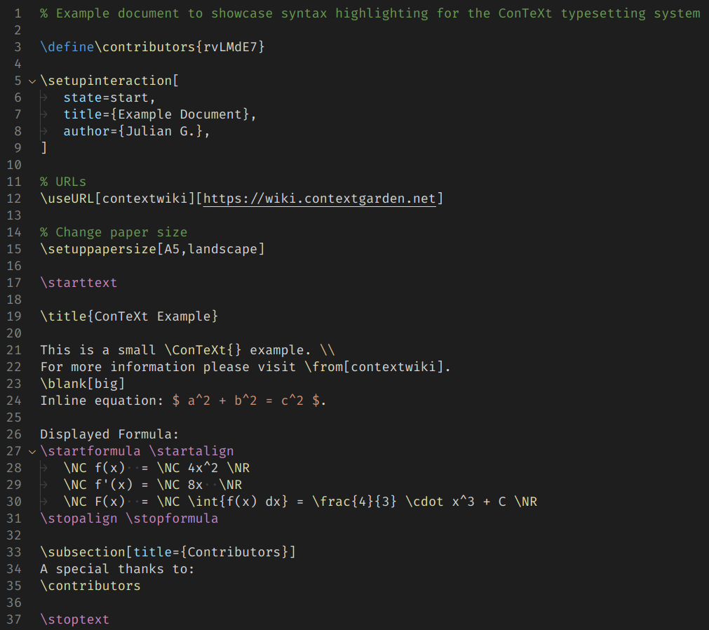

# ConTeXt Syntax

A simple Visual Studio Code extension that enables syntax highlighting for ConTeXt.

The Syntax definitions have been imported from this [TextMate package](https://github.com/pgundlach/context.tmbundle/blob/master/Syntaxes/ConTeXt.tmLanguage).

For more information on ConTeXt typesetting please visit [contextgarden.net](contextgarden.net).

## Example

Screenshot of [example.tex](example/example.tex)

## License

The above mentioned [tmLanguage file](https://github.com/pgundlach/context.tmbundle/blob/master/Syntaxes/ConTeXt.tmLanguage) was created by Patrick Gundlach, who has given permission to use said file for this extension under the MIT License.

See [LICENCE](LICENCE).

## Release Notes

Please refer to [CHANGELOG.md](CHANGELOG.md).